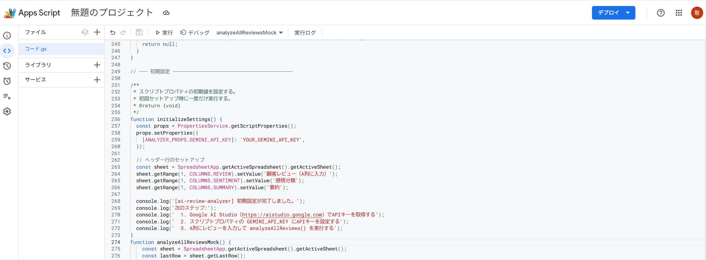
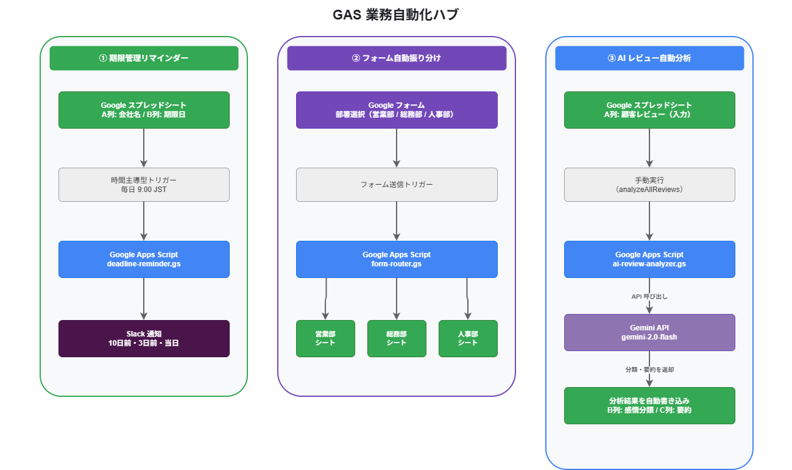

# gas-business-automation-hub


## Googleスプレッドシート × AI で、面倒な業務を全自動化するツール集

契約期限の確認、フォーム仕分け、レビュー分析——
追加費用ゼロ・インフラ不要で、今すぐ自動化できます。



---

## こんなお悩みを解決します

- 契約期限・支払期限の確認漏れによるヒューマンエラーをなくしたい
- 問い合わせフォームの仕分けを手作業でやっていて非効率
- 顧客レビューの集計・分析に毎月時間がかかっている

---

## 収録ツール一覧

| # | ツール名 | できること | ファイル |
|---|---|---|---|
| ① | 期限管理リマインダー | 契約・支払期限をSlackへ自動通知（10日前・3日前・当日） | `deadline-reminder.gs` |
| ② | フォーム自動振り分け | フォーム回答を部署別シートへ自動転記 | `form-router.gs` |
| ③ | AIレビュー自動分析 | 顧客の声をGemini AIが自動分類・要約 | `ai-review-analyzer.gs` |

---

## アーキテクチャ



```
① 期限管理リマインダー
   スプレッドシート（期限日）
       ↓ 毎日9:00（時間主導型トリガー）
   Google Apps Script
       ↓
   Slack通知（10日前・3日前・当日）

② フォーム自動振り分け
   Googleフォーム（回答送信）
       ↓ フォーム送信トリガー
   Google Apps Script（部署を判定）
       ↓
   各部署シートへ自動転記

③ AIレビュー自動分析
   スプレッドシート（レビュー入力）
       ↓ 手動実行 or ボタン
   Google Apps Script
       ↓ Gemini API呼び出し
   分類結果・要約を自動書き込み
```

---

## 技術選定の理由

### なぜ Google Apps Script なのか
- **追加インフラ不要**: サーバー・クラウド費用ゼロで運用できる
- **Googleサービスとの親和性**: スプレッドシート・フォーム・Gmailと簡単に連携できる
- **非エンジニアでも運用可能**: スクリプトエディタのみで設定・実行が完結する

### なぜ Gemini API（gemini-1.5-flash）なのか
- **Google Workspaceとの相性**: 同じGoogleエコシステムで認証・管理が統一できる
- **日本語精度**: 日本語のレビュー分析に高い精度を発揮する
- **コスト効率**: gemini-1.5-flash は高速かつ低コストで大量処理に適している

---

## セキュリティへの配慮

| 項目 | 対応内容 |
|---|---|
| APIキー管理 | `PropertiesService`（スクリプトプロパティ）で管理。ソースコードに含まない |
| シークレットの漏洩防止 | `.gs` ファイルにAPIキー・Webhook URLをハードコードしない設計 |
| 最小権限 | 各スクリプトが必要なGoogleサービスのみにアクセス |

---

## 導入の流れ（3ステップ）

```
Step 1: スクリプトエディタを開く
        （スプレッドシート → 拡張機能 → Apps Script）

Step 2: initializeSettings() を実行する
        （スクリプトプロパティに初期値が自動設定される）

Step 3: APIキー / Webhook URL を設定して完了
        （プロジェクトの設定 → スクリプトプロパティ）
```

詳細な手順は [docs/setup-guide.md](./docs/setup-guide.md) を参照してください。

---

## 導入事例イメージ

> **課題**: 毎月末、担当者が手動でスプレッドシートを確認して請求書の期限をチェックしていた。確認漏れが月に2〜3件発生していた。
>
> **解決**: 期限管理リマインダーを導入。10日前・3日前・当日にSlackへ自動通知されるようになり、確認漏れがゼロになった。

---

## カスタマイズ対応例

- **通知先の変更**: Slack → Gmail に変更（`MailApp.sendEmail()` に差し替えるだけ）
- **分類カテゴリの追加**: プロンプトを修正して「緊急度判定」「カテゴリ分類」を追加
- **AIモデルの切り替え**: Gemini → Claude / ChatGPT への変更も可能（APIエンドポイントの変更のみ）
- **振り分け部署の追加**: `form-router.gs` は「設定」シートにA列へ追加するだけで対応

---

## フォルダ構成

```
gas-business-automation-hub/
├── README.md
├── LICENSE
├── appsscript.json            # GASプロジェクト設定
├── deadline-reminder.gs       # ① 期限管理リマインダー
├── form-router.gs             # ② フォーム自動振り分け
├── ai-review-analyzer.gs      # ③ AIレビュー自動分析（メイン）
└── docs/
    ├── setup-guide.md         # 非エンジニア向けセットアップ手順
    └── architecture.png       # アーキテクチャ図
```

---

## お問い合わせ・カスタマイズ依頼

カスタマイズや導入サポートのご依頼は、クラウドワークスのプロフィールからご連絡ください。

[クラウドワークス プロフィール（リンクは後で設定）]

---

## 開発者向けノート

本リポジトリは、非エンジニアの方でもブラウザ上のコピー&ペーストのみで簡単に導入できるよう、あえてシンプルな `.gs` ファイル構成にしています。
`clasp`（GAS 公式 CLI）や TypeScript を用いたローカル開発環境の構築は不要です。

エンジニアが本番運用に向けて拡張する場合は、以下の構成への移行を推奨します：

```bash
# claspを使ったローカル開発環境の構築
npm install -g @google/clasp
clasp login
clasp clone <スクリプトID>
```

---

## 関連リポジトリ

- [aws-bedrock-agent](https://github.com/satoshif1977/aws-bedrock-agent) - Bedrock Agent + Lambda FAQ ボット（Terraform）
- [aws-rag-knowledgebase](https://github.com/satoshif1977/aws-rag-knowledgebase) - S3 + Bedrock RAG 構築
- [aws-eventbridge-lambda](https://github.com/satoshif1977/aws-eventbridge-lambda) - EventBridge + Lambda イベント駆動（Terraform）
